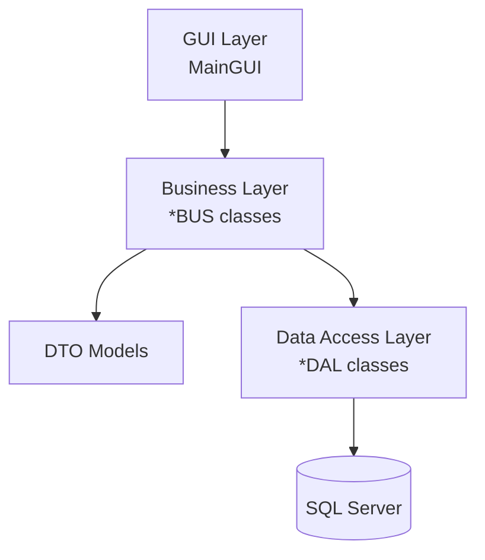

# TourManagement

Simple tour management desktop application built with Java, Maven, and a layered architecture (GUI → BUS → DAL → MSSQL). The project models tours, bookings, customers, invoices, permissions, and supporting entities.

## Team Members

| Student ID | Full Name             |
| ---------- | --------------------- |
| 3121410431 | Lê Tấn Tài            |
| 3121410078 | Phan Chí Bảo          |
| 3124560092 | Nguyễn Thị Tuyết Trâm |
| 3124720045 | Lê Trương Thảo My     |

## Introduction

TourManagement is a learning-grade system that demonstrates how to organize a desktop Java application with clear separation between presentation (Swing GUI), business logic (BUS), data transfer objects (DTO), and data access (DAL) against Microsoft SQL Server. It includes reporting support via JFreeChart and Lombok for concise models.

## Key Features

- Tour catalog management (types, destinations, itineraries, transport).
- Customer and guide management with role/permission scaffolding.
- Booking and invoice handling with discount support.
- JFreeChart-based reporting foundations.
- MSSQL connectivity through the official JDBC driver.

## Overall Architecture

The codebase follows a classic layered structure.



## Installation

Prerequisites:

- JDK 21+ (project uses Maven compiler release 25; 21+ recommended).
- Maven 3.9+.
- Microsoft SQL Server instance.

Steps:

1. Clone or download the repository.
2. Install dependencies and compile:
   - `mvn clean install`
3. (Optional) Import `tour_management.sql` into your SQL Server to provision schema and seed data.

## Running the project

From the project root:

- `mvn exec:java -Dexec.mainClass=com.mycompany.tourmanagement.TourManagement`
- Or build then run: `java -jar target/TourManagement-1.0-SNAPSHOT.jar`

## Env configuration

Set database connection details as environment variables or system properties and read them in your DAL connection logic (e.g., `ConnectionDAL`):

| Key           | Example           | Purpose           |
| ------------- | ----------------- | ----------------- |
| `DB_HOST`     | `localhost`       | SQL Server host   |
| `DB_PORT`     | `1433`            | SQL Server port   |
| `DB_NAME`     | `tour_management` | Database name     |
| `DB_USER`     | `sa`              | Database user     |
| `DB_PASSWORD` | `StrongPassword!` | Database password |

Connection string example:
`jdbc:sqlserver://localhost:1433;databaseName=tour_management;encrypt=true;trustServerCertificate=true`

## Folder structure

```
src/main/java/
├─ com/mycompany/tourmanagement/TourManagement.java   # Entry point
├─ GUI/                                               # Swing UI (MainGUI)
├─ BUS/                                               # Business services
├─ DTO/                                               # Data transfer objects
├─ DAL/                                               # SQL Server data access
├─ image/                                             # Sample assets
tour_management.sql                                   # Database schema/data
pom.xml                                               # Maven build
```

## Contribution guidelines

- Use feature branches and submit pull requests.
- Follow the existing layered boundaries: GUI → BUS → DAL; keep DTOs simple.
- Prefer Lombok annotations for boilerplate in DTOs.
- Add or update SQL scripts when schema changes.
- Run `mvn clean install` before opening a PR to ensure builds pass.

## License

Specify the project license here (e.g., MIT). If none is chosen yet, add one to the repository root.

## Roadmap

- Flesh out GUI workflows for tours, bookings, and invoices.
- Implement real authentication/authorization using `NhomQuyen`/`TaiKhoan`.
- Add validation and error handling across BUS and DAL.
- Expand reporting dashboards with JFreeChart.
- Add automated tests and CI workflow.
